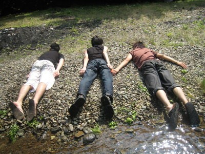
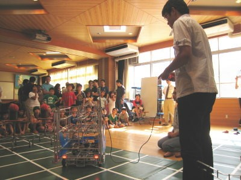

記念すべき実態報告その１です。 ロボコンメンバーはだいたいいつも、この様にみんなで死体ごっこ（\*１）を行っています。  仲がよさそうです。 みんなで河原で心中ごっこです。 なんていうのは冗談で、たいていは  このように地道に活動しています。 今回実演をしに行ったのは、我が大学の近くの松ヶ崎小学校。 ちょっとした講演（？かな？）とロボットの実演を９月６日に行いました。 みんな、ロボットを動かせて面白かったみたいですが、 どちらかというと……大人（学校関係者、見学してくださってた保護者の方）の方が、楽しんでくださったみたい？です。 我らが恩師・澤田先生（\*2）と関係者の方々との話が弾んでました。 しかし子供のパワーはすごいです。 どこに電池がそんなに搭載されているの？と思わずにはいられない……。 ！ああ！人間の電池も使うたびに磨耗して充電切れるのが早くなるのか……！ 人間の電池パックも寺町（\*3）行ったら売ってないかな。 （\*1）死体ごっことは、私（TECHNOUS-H広報担当・西脇）が幼少の頃より嗜んでいる遊びのことである。対応人数は、１名から５名くらいまで（それ以上になると、流石にあやしまれて通報される可能性があるため）。 （\*2）我がロボコン挑戦プロジェクトの顧問の長（だと、西脇は認識している）。 （\*3）京都にある電気街。だが、日本橋や秋葉原などに比べると、足元にも及ばない。涙。
