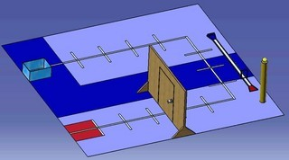

先日の記事の通り、現在ロボコン挑戦プロジェクト(以下、TECHNOUS-H)では様々な計画が立ち上がっています。 今回はさらにその一つ、2回生が中心となって進めている**「ともひろ計画」**について記したいと思います。 まずプロジェクト名ですが、 Totalized More and Hi\-technical Robotics Project   いう文法めちゃくちゃな正式名称を略したらたまたま「ともひろ計画」となりました。 TECHNOUS-Hのリーダーの名前を意識したなどという事実は一切ありません。 さてそんなことはおいといて、詳細を。 小規模ながらNHKの大学ロボコンに似たルールを自分たちで設定し、これに基づいてロボットを制作するという計画なのです。 先日紹介したGENESIS計画はその後の調査により足回り(移動機構)の先端技術開発であることが判明しました。ならば2回生はアームの技術開発を行おうということになり、アームが重要となるルールを設定しました。どんなルールなのかは今度もし気が向いたら書こうかと思います。 とりあえず今日のところは「競技フィールド」のイメージ画像でお楽しみください。

