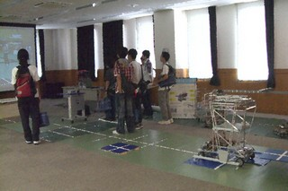

今月7日に本学のオープンキャンパスが開催され、 ロボコン挑戦プロジェクトもこれに出展しました。 機械システム工学課程志望の人を中心に、多くの人が見に来てくれました。

 第一陣を前に、とりあえず映像で時間を稼ぐ。。。

ブースでは今年のNHK大学ロボコンに出場したロボットやパネルを展示し、 映像やスライドなども用いてプロジェクトの概要を紹介しました。 少しでも私たちの活動や本学の機械システム工学課程に興味を持っていただけたのなら幸いです。 などと言うてるワタクシは造形工学課程。。。
