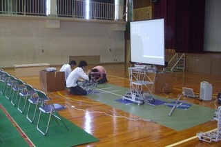

今日、ロボコン挑戦プロジェクトは京丹後市立溝谷小学校にて講演を行いました。 TECHNOUS-Hを指導してくださっている澤田先生のロボットに関する講義から始まりました。 そして、メンバーはNHK大学ロボコンに出場したロボットを使った講義・実演を行いました。 前日に現地入りし、会場やロボットのセッティングを行いました。 京都駅を10時半前に出発し、13時に最寄り駅に到着しました(けっこう遠い)。

 小学校に到着後、すぐ準備に取りかかりました。

幸いなことに大きなトラブルもなく、2時間弱で準備は終了しました。 そのため、この日は早めに宿舎に入ることができました。 この「宿舎」ですが、その名を 京都工芸繊維大学 京丹後キャンパス といいます(へ～)。

 そう、日本海が近いのです

本学は京丹後市といろいろあるみたいで、今回の講演もその関連という訳です。 詳しく知りたい方は本学の公式サイトへどうぞ。

 次回は講演当日の様子について報告したいと思います。
