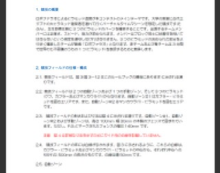

先日、ABUロボコン(NHKロボコンの世界大会にあたるもの)2010年大会のルールが発表されました。 これはそのままNHK大学ロボコンのそれとして用いられます。 この世界大会のルールは当然ながら、いんぐりっしゅ版であります。 日本語版の公開は例年一月ほど遅れます。 すなわち、日本語版を待っていたら出遅れるのです。。。

 ハイ、訳しました。

一次審査用の書類は12月頃がしめきりです。 3ヶ月ほどしかありませんが、メンバーでアイデアを出し合って優れた書類を作りたいと思います。

* * *

ちなみに、09年のNHK大学ロボコン(国内大会)の全試合版の番組放映が決定したそうです。 9月放送予定だそうです。

・・・あの、乗り込みをもう一度。
