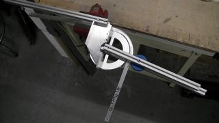

新入生が非常にたくさん入ってくれて、うれしい悲鳴を上げている毎日です。新入生向け部内ロボコンも順調に進んでおり、一ヵ月後にはたくさんのロボットが完成していることでしょう。

上回生も負けてはいられません。

まず、今年は初めてかわさきロボット競技会に挑戦します。 すでに応募書類の提出も終わり、設計をすすめているところです。 NHK大学ロボコンとは違うからこそ、 使ったことの無い材料や加工法等あらゆることを試してみたいと考えています。 とはいえ、かわさきロボットには一台しか出しません。 なぜなら他のプロジェクトも進行中だからです！

↓これはその内のひとつの「パイプベンダー」。  写真のものは突貫で作った試作機ですが、良い感じのものができそうです。
