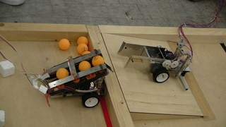
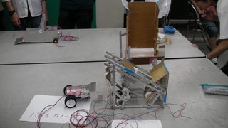

先日，新入生向けに部内ロボコンを行いました．

ルールは対戦形式で，各１台のロボットで自分と対戦相手の２分されたフィールド上に点在するオブジェクト(ボールとか箱)を時間内に相手のフィールドに多く運び込んだ方の勝利，といったシンプルな物です．(ミニロボコンを参考にさせていただきました．)

今年は新入生が２７名と多く，予算的な問題から2・3人一組でロボットを作ってもらいました．

２回生も加わり，計１４台のロボットが完成． どのロボットも完成度が高く，かなりの接戦で見ていてとても面白かったです． 終盤でコントローラーが破損すると言うハプニングも発生しましたが・・・みんな笑っていたので良しとしましょう(いいのか？)．

対戦風景

優勝ロボット

主な目的は ・新入生にロボット作りの楽しさを体験してもらう(実は体験入部) ・設計する上での基礎知識を吸収してもらう ということでしたが・・・

何名入ってくれるでしょうか・・・？

ちなみに終盤の試合は公平にするため両チームともコントローラーが半壊状態で対戦しました(笑)．来年は丈夫なの買ってね
