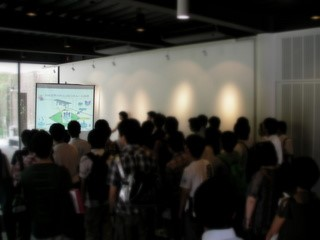
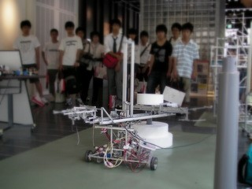

もう4日たってしまいましたが，8月10日にオープンキャンパスがありました．

たくさんの人が各課程に分かれて，ツアー形式で色々な施設・研究室を回っていたようです．

我々ロボコン挑戦プロジェクトも60周年記念会の一角を借り，展示と案内をさせて頂きました．

主に機械システム工学課程の見学者の人が訪問されましたが(コースに含まれているので) それ以外にも電子や情報，造形の方も訪問されました． 現メンバーはロボットしか作れないので，機械以外の人も(特に広報とかデザイン出来る人)参加してくれるとありがたいですね．

プレゼンの様子

 実演の様子

たくさんの人に少しでもロボコンに興味を持ってもらえたでしょうか・・・？

10月16日のオープンキャンパスにも出展する予定ですので，興味のある方・見逃した方は，また訪問ください．
