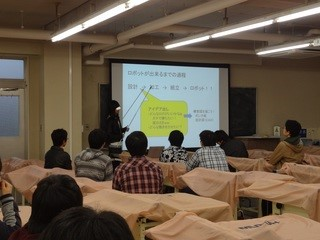

桜が咲く季節も過ぎ、新緑が芽吹く季節になりました。 体験入部期間ではありますが、ロボコン挑戦プロジェクトにも新たなメンバーが顔を出してくれています。 今年で開催二年目になる「部内ロボコン」への準備も始まり、下回生上回生共々和気あいあいとにぎわっています。

 さて、そんな中、新二回生が新入生に向けて勉強会を開催しています。 第一回、第二回分が終了しているので、以下にその大まかな内容を紹介したいと思います。

第一回　『機構機械部品について』 一回目の講義では「ロボットってどうやってつくっていくんだろう？」「ロボット設計ってどんな風にしたらいいんだろう？」というようなことを説明しました。

第二回　『足回りについて』車輪配置のパターンごとに安定性の説明をした後、モーターの種類をいくつか説明し、機構によって使い分けられることを理解してもらいました。

思っていたよりも多くの一回生が訪れ、真剣に講義を聞いている姿が見受けられました。 二回生一同、一回生達と共に成長してゆければと思います。

さてさて、今回の記事はこれくらいにしておこうかと思います。 次回記事では部内ロボコンについて書こうかなぁなんて考えています。（準備中の様子なんかもお見せできたらいいなぁ…）
