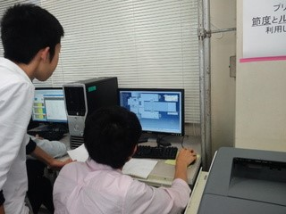
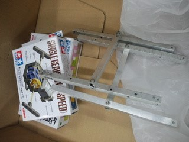
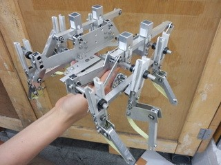

前回予告した通り、今回の記事では「部内ロボコン」についてあれこれ書いていこうかと思います。

**■フィールドについて** 今年は去年のフィールドを改編し、少し難易度をあげています。 去年は押し出し機構が大半を占め、簡素な造りのロボットが多すぎたためです。 今年のフィールドだと押し出しで大量得点を狙うことができなくなり、アームや打ちだしなど、得点への様々な工夫が必要となります。

▲フィールドCAD

**■ルールについて** 去年はミニロボコンのルールを参考にさせていただき、ルールを製作しました。対戦形式で、各１台のロボットで自分と対戦相手の２分されたフィールド上に点在するオブジェクト(ボールとか箱)を時間内に相手のフィールドに多く運び込んだ方の勝利、といったシンプルものでした。 今年はそのルールを少しだけ改編しました。フィールドの仕様変更以外の大きな変更点は一か所で、去年までただの箱とピン球だったオブジェクトをサイコロとピン球に変更し、得点に振れ幅を持たせた点です。

■現在の作業風景

多くの班はメンバーが協力し合ってCADによるロボット設計に取り組んでいます。

外注していた部品も届き、これから本格的な部品製作・組み立て作業が始まります。

先輩チームは進行が速いです。（さすがですね）

なにやら複雑な機構になっています。

参加予定は8チーム13人。そこへ二回生チームやスペシャルゲストなども加わり、今年もまた部内ロボコンを大いに盛り上げてくれそうです。
