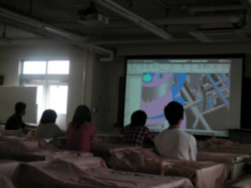

更新が遅くなってしまいましたが、GW中、私達ロボコン挑戦プロジェクトでも色々なことがありました。

今回と次回は二回連続で、GWの活動を綴った記事を書こうと思います。 

さて画像ですが、金沢工業大学にある夢工房プロジェクトのうち、NHK大学ロボコンに挑戦するプロジェクトの方が来訪されました。 私達ロボコンメンバーにロボットの開発体制やNHK大学ロボコン関連の話などの紹介をしてくださいました。 私たちも活動スペースや、ロボット設計のCADデータなどを紹介し、大学間でさまざまな情報のやり取りをすることができました。 交流会などの行事は、大会毎に顔を合わせる程度とどうしても少なめなので、他大学の活動に触れられることのできた今回の交流では得るものがとても多かったです。  ↑ロボットの設計CADも見せていただきました！

私たちは、ロボットに携わる皆さんとの交流をたくさんしていけたらいいなと思っています。 京都に立ち寄る機会がある方はぜひぜひ京都工芸繊維大学まで遊びにいらしてくださいね！ （近所においしいラーメン屋さんがたくさんあるので、案内しますよっ♪）
