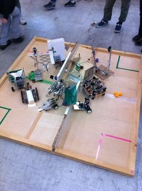
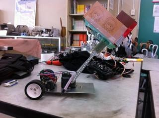
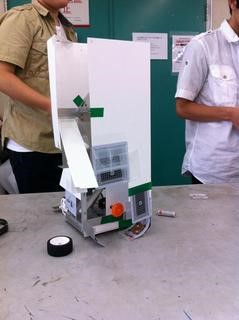
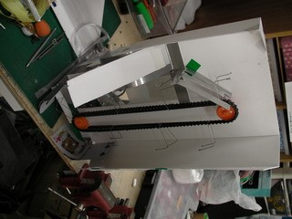
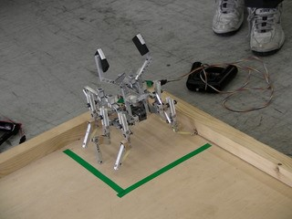
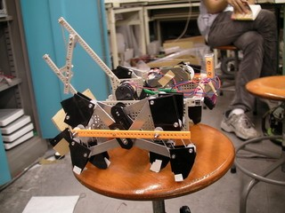
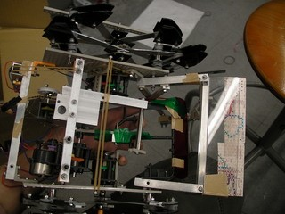
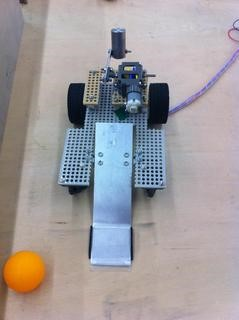

６月２３日に部内ロボコンを開催しました！１回生チームの調整の行き届いたロボットや、二回生チームの技巧に凝らされたロボット達が一堂に会し、熱い戦いを繰り広げました。

 予選はAブロックBブロックに分かれて総当たり戦をし、その後、決勝トーナメントを行いました。 大小さまざまなロボットが登場していました。

それでは１、２、３位のロボットを紹介します！  ▲バキプラス（優勝ロボット） シンプルイズベスト！といったような作りですが、多様なアクロバット操縦を見せてくれました。一回生の作品です。 モーターのトルクに対応できるようアームの重さを軽くするのに苦労していたようです。 メイドさんの厚紙は部室に置いてあった秋葉原土産のクッキーの外箱を利用したのだとか。 名前の由来は…とある先輩のあだ名をもじったものなのだとか…？ ちなみにその人は最終決戦で「バキプラス」という名前が連呼されていて嫌そうな顔をしていたのだとか。

▲アベントコルベ（準優勝ロボット） 下の方でオブジェクトをベルトコンベアにひっかけた針金の爪にひっかけ、頂上まで持って行き、滑り台から落とすという戦法でした。こちらも一回生の作品。 様々な動作を一つの機構に集約するというコンセプトでつくられたこのロボットは、大量得点で対戦相手を翻弄していました。 トランプを材料に使った所がミソなんだとか。 名前の由来については「逆から読んだらわかるよ～」とのこと。

 ▲KUMO－MⅡ（三位ロボット） これは二回生の作品です。左右ひとつずつ、計二つのモーターで六本の足を動かします。 さすが先輩というか、やはり圧巻でした。 前についた大きなアームも微調節ができる作りになっていて、複数のオブジェクトをひょいひょい掴んでいました。 名前の由来は「某ゾイドとは無関係ですよ～」とのこと。

次に、デザイン賞とアイデア賞のロボットをご紹介♪ 

 ▲アポカリプすばらっ！（デザイン賞ロボット） 二体目の脚ロボットの登場です！これは一回生の作品。 製作者いわく「僕のこだわりは脚というよりむしろアームなんですよ！」とのこと。 モーター数が少ない中、アームの微調整ができるようワイヤーや輪ゴムが張り巡らされていました。 足回りがものすごい速度で動いていて、見た目より素早く移動していました。 名前の由来は好きな某麻雀格闘マンガのきめぜりふより（たぶん…マニアックデスネ…）

 ▲チキンラーメンIKEDA　（アイデア賞） ハンマーをモーターで振りおろし、てこの原理で掬い上げたオブジェクトを相手陣地へ飛ばすユニークな作品。こちらも一回生の作品です。 オブジェクトを飛ばす姿が可愛らしく、「健気だなあ～」などの声があがっていました。 難しい加工ができないことを考慮に入れ、できるだけシンプルになるように目指したのだとか。 名前の由来は製作した二人が両方とも池田市（大阪府）に住んでおり、町の観光スポットである「チキンラーメン記念館」を宣伝したかったからこの名前にしたそう。賞を取れてしっかり宣伝役になれてよかったですね！（笑）オリジナルインスタントラーメンを作ることができるそうです。

以上、部内ロボコンの報告でした。 ロボット完成時の感動は格別なものだったと思います。一回生が楽しんでくれたようでよかったと思います。

試合後は皆で打ち上げに行ってご飯を食べてきました♪　入賞者には景品授与なんかも行われ、おおいに盛り上がりを見せました。

この部内ロボコン終了で、一回生の仮入部期間が終わります。 先輩方一同、一人でも多くの一回生がロボコンに本入部してくれるのを待っています！ ロボット作りの楽しさは伝わったんじゃないかなぁと思います。これから是非一緒にロボットを作ってゆきましょう！
