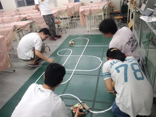

  

おはようございます！　大会当日の朝です。 TECHNOUS-KIT部室では多くのメンバーが最終調整をしています。

合同ロボコンとは、関西圏のロボットを製作している大学が集まり、初心者から上級者まで製作を楽しめる、「ライントレーサー」と呼ばれるロボットを製作し、持ち寄ります。技術の向上と各大学の交流を目的として行われている大会で、歴史は長く、もともとは京都大学さんが主催されていた大会でした。

今年の大会幹事校は立命館大学さんで、会場はびわこくさつキャンパスだそうです。私たちも大会に向け、七時頃には出発する予定です。

合同ロボコンは一回生ソフト班のメンバーにとって初めての参加となる大会です。 一回生諸君が多くを得られることを期待しています。
