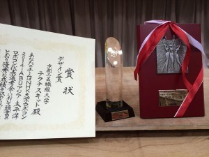

こんにちは。ふじきです。

ついに6月1日(日)にNHKロボコン2014が開催されました。 全国からビデオ予選を通過してやってきた合計18大学が参加し波乱に富んだ内容になりました。

当大学は今大会で去年同様にベスト8入りを果たしました。 更にデザイン賞とトヨタ自動車株式会社様から特別賞をいただき、当プロジェクト発足以来の好成績を挙げました。

とはいえ、今年の目標の一つであったベスト4入りはできず、強豪校との優勝争いにはまだまだ至らないところがたくさんあることも自覚させられた結果でもあります。

本来なら当日の試合の内容や他大学のユニークなロボットを紹介したかったのですが、流石に自分も昨日の夜に東京から帰ってきたばかりで疲労が蓄積しているので今回は短く結果をお知らせするだけにとどめておきます。

それでは失礼します。
