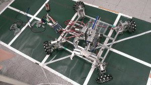

こんにちは、ぺったんです。

今回は、当プロジェクトで製作している広報用機体についてご紹介します

当プロジェクトでは前年度からより一層広報に力を入れるようになり、イベント等に参加する機会が多くなりました。

しかし、当プロジェクトにはイベントに展示するためのロボットがなく、毎回前年度のNHK大学ロボコンに使用したロボットや、個人が製作したロボットを展示していました。

そこで当プロジェクト内で話し合った結果、イベント専用のロボットがあったほうが良いということになり、広報用として使用するロボットを製作することになりました。

 

上の写真に写っているロボットが、現在製作している広報用のロボットです。

足回りは、前後左右の平行移動とその場での旋回が可能です。またサスペンションを導入しているので、ある程度の地面の凸凹に対して対応することが出来るようになっています。

アームについては、上下前後の移動と回転が可能で、エアシリンダで駆動するハンドでオブジェクトをつかむ機構になっています。

イベントではオブジェクトにペットボトルを使い、ロボットが移動しながらオブジェクトをつかむところを披露する予定です。 では、失礼します。
