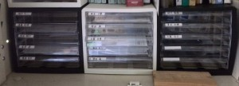

こんにちは。ふじきです。

先月から当プロジェクトではハード班の加工の振り分け方を変えました。

以前までは部品の加工はハード班全員のスケジュールを聞いたうえで加工シフトを組み、その時間帯に工場に行く人、部室で作業する人などを決めて図面を処理していくという形式を取っていたのですが、シフトに入っていたことを忘れていたり簡単な部品の図面を取り合って難しい部品の加工が後に残ったりしてあまり能率がよくありませんでした。

そこで改善策として、部員一人一人に加工してもらう部品の図面を振り分けておきそれを期限内にこなしてもらうという形式に変えました。

このようなケースに各自の名前が入った引き出しを作りそこに図面を入れておきます。

これなら加工シフトを毎回作らなくても各自の作業可能な時間を予め聞いておき、それに見合った分の図面を振り分けるだけで済みます。 また各部品の期限が明示されているので早く終わらせなければならないという各々が自分の仕事に責任感を持つことができます。 実際の会社で課すようなノルマと違い、図面を交換したり期限までに間に合いそうにないなら誰かに代わりにやってもらったりとある程度の自由度も当然あります。

まだ始めたばかりではありますすが、以前に比べるととても加工の能率が上がったように感じます。 今年のNHKロボコンは予定では3号機まで作ってそれを本番機にする予定でしたが、加工が間に合わず、2号機までしか作れませんでした。 来年のNHKロボコンでは今度こそ3号機まで作りたいと思っています。 それでは失礼します。
