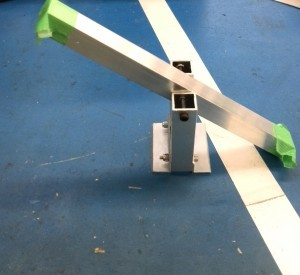
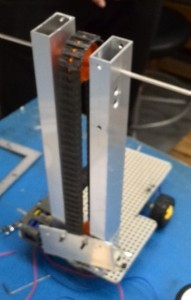

こんにちは。ふじきです。

来週当プロジェクトでは主に新入生を対象にした部内ミニロボコンが開催されます。 これは新入生が早い内に課題を達成するためのロボットを自分で考え設計し実際に作る経験を積むことが目的です。

記念すべき第1回目の内容は参加者が一台のロボットを作ってフィールド内に置かれた6つのシーソーの内3つを自分側のフィールドに倒すスピードを競うというものです。

 

新入生の中には早速先週からロボットを作り始めて完成目前の人もいます。

もちろんミニロボコンは上回生も参加可能で既に何人か参加の意思を示しています。 極々小規模な内容とはいえ課題達成のアイデアを考えるいい練習の場になると思うので上回生であっても参加する意義は十分あると思います。 果たして上回生を打ち破ることができるのか？ 新入生の手腕に注目です。

次回の更新予定は6月20(金)を予定しています。 それでは失礼します。
