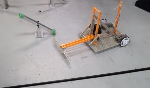
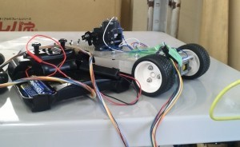
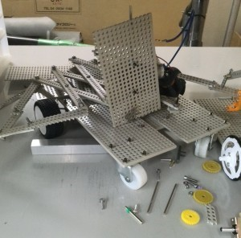
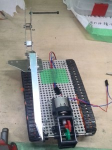

こんにちは。ふじきです。 前回予告していた部内ミニロボコンを6月24日に行います。 今のところ参加を予定しているのは上回生を含めて数人ですが、飛び入りで参加する人もちらほらいそうな雰囲気です。(ひょっとしたら自分も参加するかもしれません)  
  
課題の内容は1人1台のロボットを操作して6つのシーソーの内、自分のエリアと同じ色の3つのシーソーを先に自分のエリアの側へ倒したほうが勝ちとなります。 試合は総当たり戦で行われる予定です。試合後には機体の総評や改良点などを話し合います。  
第1回目ということもあり、NHKロボコンやキャチロボに比べればとても単純な課題でロボットの方もおもちゃみたいものではありますが、課題を達成できるロボットをきちんと作成する練習の場になると思うので今後も続けていきたいです。  
次回の更新予定日は6月27日(金)です。 それでは失礼します。
