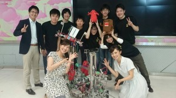
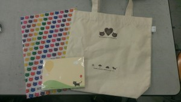

こんにちは、ぺったんです。

 

当プロジェクトは6月19日(木)に、NHK総合テレビにて放送されている『ぐるっと関西 おひるまえ』という番組に生出演しました。 今回はこのことについて、生出演するまでの苦労話などを含めてお話します。

 

 

まずは、番組に生出演した前日の事についてお話します。 生放送ではNHK大学ロボコン2014の親ロボットと子供ロボットを動かしたのですが、これらのロボットは前日にスタジオへ運搬する必要がありました。 ですので、前日は荷物等をトラックに積み込むために、ロボットの整備に必要な物を整えたり、ロボットの梱包を行ったりしました。ロボットの梱包等はNHK大学ロボコンの時に一度行っていたので、比較的すんなりと済ますことができました。

 

生出演する当日は、午前9時前に出演するメンバー全員が集合し、その後すぐにロボットの整備をはじめました。 しかし、ポールウォークに使用するフィールドは自前で用意したのですが、このフィールドは組み立てる度にポールの位置が微妙にずれるため子供ロボットがうまく動作しなくなってしまいました。これに加え、ロボットの整備に1時間しか割くことができなかったので、調整には大変苦労しました。 また、親ロボットにはエアーが漏れるというトラブルが発生しました。これはエアーが漏れる量が少なかったため、ロボットを動かす直前にエアーを入れることで解決しました。 エアーコンプレッサーは[以前ご紹介した小型のもの](http://www.fortefibre.net/blog/?p=1272)を使用したのですが、これには圧縮空気を溜めておくタンクがないため、ロボットにエアーを入れるにはコンプレッサーを動かし続かせないといけません。本番中に動作音が大きいエアーコンプレッサーを動かすわけにはいけないので、対策として予備として持ってきておいたペットボトルをタンク代わりにして使用しました。

 

本番では、当プロジェクトがどのような活動をしているか紹介したり、大会当日や前日のことについて話をしたりしました。また、ロボットがポールウォークをこなすところを実際に披露したりもしました。生放送中は、調整の甲斐あってロボットは一度もポールウォークを失敗せずに動いてくれました。 出演したメンバーによると、リハーサルでは立ち位置などを細かく計画し、トークなどはほとんど練習できていなかったらしいのですが、MCの方々に助けられ特に詰まったりせずに話し切ることができたようです。 また、急遽番組の最後にメンバー全員を映していただけることになりました。そこで、制御担当が子供ロボットに手を振らせられるように動作を変更し、最後に子供ロボットを含めた全員が手を振りながら番組が終了しました。

 

番組終了後は、クリアファイルやトートバッグなど、出演したメンバー全員に多数の記念品をいただきました。

 

 

6月1日に開催されたNHK大学ロボコン2014の様子は、7月21日（月）午前10時05分より、NHK総合テレビにて放送予定です。 是非ご覧ください！

 

次回の更新は6月30日(月)を予定しています。 では、失礼します。
