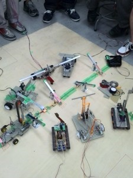
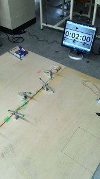
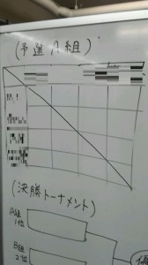
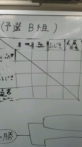

こんにちは。ふじきです。  
先週行われたミニロボコンの風景です。   
当初の予定では参加メンバーは5人程でしたが、当日になって機体を完成させた2回生メンバーが何人か飛び入り参加(自分も家から持ってきた機体で参加しました)して大きく盛り上がりました。  
本来は総当たり形式で行う予定でしたが、人数が増えたためNHKロボコンのように予選リーグを２つ設け各リーグの上位2名で決勝トーナメントを行いました。   
今回の主役であるハード班1回生の機体は時間を練って考えられている分、シーソーを倒すための機構をきちんと作り上げていました。 飛び入り参加した2回生組も間に合わせで作った割にはなかなかの活躍を見せていました。 結局優勝したのは3回生ですが、1回生の中には上回生相手に善戦する活躍を見せた者もおり今後の成長が楽しみです。  
今回、自分も参加して実感しましたがやはり大会形式にするとみんなもやる気が出ます。 普段、自分達が参加する大会と言えばはNHKロボコンとキャチロボの年に2回だけで作ったロボットで対戦するという機会は殆どありませんでした。 例え規模が小さくともこのような機会を設けることはロボコンの活動に対してのモチベーションアップとメンバー同士の交流に繋がるのではないかと期待しています。  
次回のミニロボコンも楽しみです。  
次回の更新予定は7月4日(金)です。 では失礼します。
