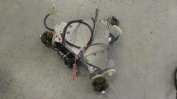

こんにちは、ぺったんです。 今回は、現在製作中であるソフト班教育用機体についてご紹介します。

 

当プロジェクトは、大雑把にまとめると主にロボットの設計や組立てをするハード班と、そのロボットを制御したり回路を設計したりするソフト班に分かれています。 そのソフト班なのですが、今までは実際にロボットを制御する機会が少なく、年に2・3回出場する大会に使用するロボットを制御するくらいでした。 よって、ソフト班の技術の継承を兼ねて、制御をする機会を増やすという目的でソフト班教育用の機体を製作しています。

 

 

写真は製作中のソフト班教育用機体です。写真には足回りしか写っていませんが、これとは別にオブジェクトを掴んで足回りに載せるアームが1台あります。 これらのロボットは1辺が300mmの立方体に収まるように設計されており、NHK大学ロボコンに出場するロボットに比べると非常に小さいです。

 

ソフト班には、これらのロボットを使い次のような動作をしてもらうつもりです。

 

①アームが足回りにオブジェクトを載せる ②足回りがフィールドを1周する ③戻ってきた足回りに載っているオブジェクトをアームが取り、新しいオブジェクトを載せる ④以下②～③の繰り返し

 

また、これらの動作はセンサ類を駆使してすべて自動で制御してもらいます。

小さいとはいえ、このロボットは当プロジェクトがよく使う構造になっているので、これでソフト班の制御の技術が大幅に向上したらと思っています。

 

次回の更新は7月7日(月)を予定しています。 では、失礼します。
