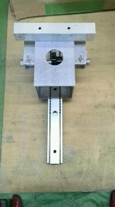

こんにちは。ふじきです。  
今回は当プロジェクトで行っている技術開発の一つを紹介します。  
ロボコンでよく用いられている機構の一つにラック・ピニオン機構がありますが、以前から当プロジェクトでは角パイプに両面テープで貼ったラックが剥がれてしまうという問題があり、NHKロボコン本番でも解決しないまま臨んだ結果恐れていた通りラックの剥がれが発生してしまいました。  
今年のそうした結果を受け、来年のNHKロボコンに向けて従来から解決を先送りにしていた幾つかの問題に対する解決策を見出すため複数の技術開発が同時並行して行われることになり、その一つとしてラックの貼り方を研究することが挙げられました。   
写真がそのための試験装置です。 ラックを様々な接着方法で貼りつけた角パイプをレールに固定し引っ張ることで接着力の強さを評価します。  
今年のNHKロボコンのテーマが既に発表されていることもあり、当プロジェクトもそちらに向けて動き出しつつあるため技術開発に割ける時間があまり無く、それほど多くの接着方法は試せないかもしれませんが少なくともここで得たデータを今年のキャチロボまでには反映できるようにしたいと思います。  
次回の更新予定は7月11日(金)です。 それでは失礼します。
