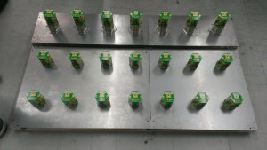
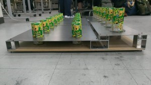
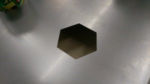
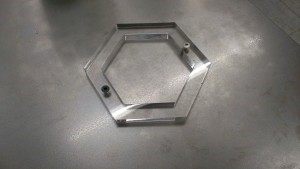

こんにちは、ぺったんです。

 

今年の9月に、当大学の60周年記念館にてキャチロボバトルコンテストが開催されます。 そのフィールドが、片面のみでありますが完成しました！

 

 

 

 

 

当プロジェクトはNHK大学ロボコンの反省を活かし、今年度からはフィールドの製作に力を入れるようになりました。 よって、少しでも大会当日のフィールドの状態に近づけるために、ワークを設置する穴やリングはすべてレーザーで加工をしています。 レーザー加工なだけあって穴やリングの精度はとても良く、ワークがすっぽりはまります。

 

 

 

レーザー加工についてですが、これは当大学のものづくり教育研究支援センターの設備を利用して加工をしています。 これまではセンターの技官の方に図面を渡し、プログラムから加工機の調整まで全てして頂いていました。しかし、最近はレーザー加工を利用する機会が増えてきたため、今年度からは技官の方の負担を少しでも減らすためにプログラムは当プロジェクトで書くようになりました。

 

フィールドはまだ片面しか完成していないのですが、ちゃんともう片方のフィールドも製作する予定です。 当プロジェクトは去年同様2チームが出場するので、早く両面のフィールドが完成してロボットが試合をするところを見てみたいです。

 

次回の更新は7月14日(月)を予定しています。 では、失礼します。
