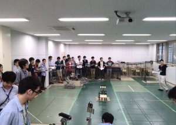
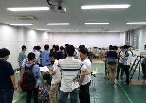

こんにちは。ふじきです。  
OB・OG会を7/13(日)に行いました。  
今年のOB・OG会ではロボットの実演と総会、そして食事会を兼ねた交流会を行いました。  
ロボットの実演では今年のNHKロボコンのフィールドを設営し手動ロボットと自動ロボットを使い競技の再現と広報用ロボットの操作実演を行いました。 広報用ロボットについては今後、子供たちに操作体験させる機会を考えると色々改良しなければいけない点や子供たちがけがをしないような対策について先輩たちからアドバイスをもらいました。    
総会ではOBの先輩の一人からドリームプランプレゼンテーションという少し変わったプレゼンを行っていただきました。  
交流会では去年と同様に食事会を開いて先輩と後輩の交流を行いました。 自分たちが知らないプロジェクトの歴史やかつてのロボットの製作秘話などを聞いたりOGの方が作ってくださったクイズなどで大いに盛り上がりました。  
OB・OG会は当プロジェクトの礎を築いた先輩たちとの数少ない交流の機会であるだけでなく、社会で活躍している人生の先輩としての貴重な話を聞ける場でもあります。 実際に参加してこのイベントの重要性を再認識しました。 いずれ自分たちが卒業した時、未来の後輩たちの役に立つような話をできる大人になりたいと思いました。  
次回の更新予定日は7月18日(金)です。 それでは失礼します。
