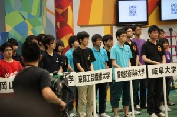

こんにちは、ぺったんです。

 

先月開催されたNHK大学ロボコン2014ですが、チーム・ピットメンバーしか知らない前日・当日のピット様子をピットメンバーが教えてくれました！ よって今回からは、NHK大学ロボコンに出場した際のピットの様子など、チーム・ピットメンバーしか知らない裏話を数回にわたってお話したいと思います。

 

 

大会前日、チーム・ピットメンバーは他のチームと同じように梱包開封作業を行っていました。 しかし、当プロジェクトのピットが汚いこと. . . ロボットや工具を引っ越し用のビニールひもを使い木箱に穴を空けて固定していたのですが、開封時に切ったひもを入れるごみ袋を持ってきていなかったためひもが散乱してしまっていました。 また、ロボットを組み立てるのに必要なパーツや工具がなかなか見つからず、何をどこに入れているかも把握しきれていなかったので、他大学様との間にキャリアの差を感じました。

 

そうこうしているうちに、ロボットのセンサチェックをする時間になりました。 当プロジェクトの子供ロボット（自動ロボット）は、ポールウォークとジャングルジムの調整にとても時間がかかってしまいます。 よって、1回目のセンサチェックでその後の動きを決める予定だったのですが、自動ロボットの制御担当が初めてのNHK大学ロボコンに緊張していたのか、ミスを連発してしまいます。

 

・自動ロボットに取り付けられているセンサの値をPCで確認しないといけないのに、フィールドにPCを忘れる ・自動ロボットにプログラムを書き込む機械を忘れたと言ってピットに取りに帰ると、実はその前にピットメンバーに預けていた

 

といった初歩的なミスを連発した結果、先生にはあきれられピットメンバーには逆に心配される始末. . . その時の感想を自動ロボット担当者に聞いてみると、「消えてしまいたかった」とのことです。

 

それはさておき、ロボットのセンサチェックです。 もちろん、この時にフィールド上の遊具全てでロボットがちゃんと動くかテストしたのですが、ポールウォークとジャングルジムが達成できないことが判明しました。 さらに、ポールウォークはどう頑張っても達成できない状況に陥っていることがわかってしまいました。 具体的に言いますと、当プロジェクトが練習するときに使用していたポールウォークは塗装をしていない鉄の板を使っていたので、板の表面の摩擦係数がある程度高くロボットが正常に動作していました。 しかし、本番では板に塗装が施されていたため摩擦係数が想定よりも著しく低く、1枚目の板から2枚目の板に自動ロボットが移動するときに1枚目をつかんでいる手が何の抵抗もなく外れてしまうという状況でした。

 

 

今回はここまでです。この続きは次回の更新で書く予定です。お楽しみに！ さらに、明日7月21日にNHK大学ロボコン2014の模様がNHK総合テレビにて放送されます！是非是非ご覧ください！ 放送される日時は、2014年7月21日(月)　午前10:05～午前11:00です。

 

次回の更新は7月21日（月）を予定しています。 では、失礼します。
