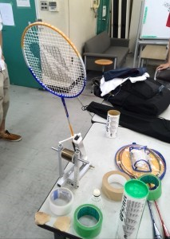
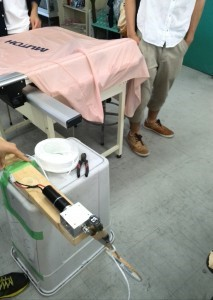
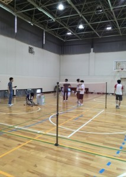
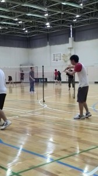

こんにちは。ふじきです。  
PCが不調を起こしたため更新が一日ほど遅れてしまい申し訳ありませんでした。  
先週の三連休の7月20日(日)に当プロジェクトは当大学の体育館を借りてバドミントンをしました。 もちろんこれは決して遊んでいるわけではありません。 NHKロボコンに携わっている人ならご存知かと思いますが、来年の2015年NHKロボコンのお題がバドミントンであることが既に公式サイトで公開されています。  
どのようなルールになるのかは想像できませんが、少なくともバドミントンの羽とラケットを使って何かやるのだろうということは予想できます。 そこで当プロジェクトはルール発表に先んじて実際にメンバーがバドミントンをやってみてその体験を設計や制御に活かせるようにバドミントンの練習をすることになりました。 これは今年の反省として課題に対する解決策をもっと柔軟に考える力を養うためにいわゆる「原点に還る」というスローガンに基づいた行動であります。 とはいえ流石に体育館を借りてまでバドミントンをやるだけでは傍から見れば、奇妙な素人集団が遊んでいるようにしか見えないので実験もかねて二台のラケットを振る機構を作りました。 左は定荷重バネ、右はモータを使った極々簡易的なハンドです。   
それぞれの機構を用いて羽を打ち出す実験をしてみたところ、定荷重バネ、モータともに羽がネットを飛び越えコートの反対側まで飛ばすことが出来ました。   
その後メンバー同士でペアを組みダブルス形式で試合をやったりしてバドミントンという競技を実際に体験しました。  この時とてもありがたいことにわざわざ僕たちに体育館の半面を貸してくれていた当大学のバドミントンサークルitwoonさんからネットを借してもらいました。 おかげでメンバー全員楽しくバドミントンを体験することができました。 itwoonさん本当にありがとうございます。 今回の経験を是非ともロボットの設計に活かしたいと考えています。  
次回の更新予定は7月25(金)を予定しています。 それでは失礼します。
