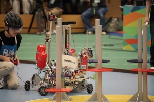
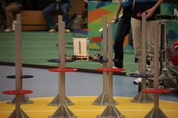

こんにちは、ぺったんです。 更新が遅れましたことをお詫び申し上げます。

 

今年の6月1日に、NHK大学ロボコン2014が開催され、またその模様が先日放送されました。 この時の前日・当日のピット様子をピットメンバーが教えてくれましたので、前回の記事([fortefibre.net/blog/?p=1637](http://www.fortefibre.net/blog/?p=1637))に引き続き、チーム・ピットメンバーしか知らない裏話をお話したいと思います。

 

 

 

前回の記事では、大会前日のセンサチェックの時間にて、子供ロボット（自動ロボット）がポールウォークを達成できないことが発覚します。 この事実が発覚してからは、お通夜のような雰囲気になる暇もなく一気に慌ただしくなりました。 それからは、ピットメンバー全員で自動ロボットのハンドに貼ることができる滑らないゴムを探し、さらにあらかじめ東京に待機していたメンバー全員に摩擦力が高そうなゴムを買ってくるように頼みました。

 

東京待機組に頼んだゴムが届くまでの間、ピットメンバーは自動ロボットに貼る良いゴムが無いか考えていました。 すると、当プロジェクトのリーダーが自分の履いている靴に目を付けました。その靴には滑らなさそうなゴムが貼り付けてありました。 最初のテストランをする時間も近づいていたので、藁にもすがる思いでその靴のゴムを切り取って自動ロボットの片方のハンドに貼り付けました。また、もう片方のハンドには大学から持参したゴムを貼り付け、テストランに臨みました。 すると、靴のゴムを貼り付けたハンドは全く滑らなかったのです！もう片方のハンドも滑りはしませんでしたが、1回の試行でゴムがぼろぼろになってしまったので、大会で使用するのは現実的ではないと判断しました。 この靴のゴムは、酷使してもぼろぼろにならない耐久力と高い摩擦力の両方を兼ね備えた、当プロジェクトが求める夢の素材だったのです！ これまでは、当プロジェクトには耐久力はあるが摩擦力の低いゴム・摩擦力は高いが耐久力が低いゴムの2つしか存在していませんでした。よって、このゴムが手に入れることができれば当プロジェクトのすべり止め技術に革命が起きるかもしれません。

 

靴のゴムの具合が良かったので、早速自動ロボットの両方のハンドに貼り付けてテストランを行いました。 テストランは合計3回行ったのですが、そのほとんどをポールウォークでの動作の調整に費やした結果、2回目のテストランで見事青面のポールウォークを成功するところまで調整できました。 しかし、赤面のポールウォークでは4枚目の板をつかむのを失敗したところで3回目のテストランが終わってしまい、その日1日を終えることになってしまいました。 また、テストランの最後でジャングルジムを1回だけテストしたのですが、そこで「自動ロボットのハンドの角度がおかしい」「最後の自動ロボットが登り切る時に、踏み桟と天板の間にハンドが挟まって抜けない」という問題が確認されました。

 

ポールウォークとジャングルジムについては、テストランの様子をビデオに撮ってもらっていたので、部屋に戻ってからメンバーで対策を考えようということになりました。 しかし、部屋に戻ってビデオを見てみると、手振れがひどい上に肝心の問題が発生しているところが映っていなく、原因究明ができませんでした。 よって、ビデオに映っていないなりに原因を予想し、翌日どのように動くかのシミュレーションをしてから会議はお開きになりました。

 

 

今回はここまでです。この続きは同じく次回の更新で書く予定です。お楽しみに！

 

次回の更新は7月28日(月)を予定しています。 では、失礼します。
