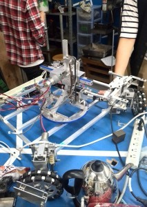

こんにちは。ふじきです。  
既に大学がテスト週間に入り、試験勉強で忙しいためなかなか更新予定日に更新することができないことをまず謝罪します。申し訳ありません。  
さて以前に紹介していた広報用ロボットですが、来るオープンキャンパスの日に披露するため様々な改良が施されました。  左が改良前、右が改良後です。 このロボットは四輪オムニの足回りに水平方向に旋回、上下に移動可能な伸縮アームを搭載し、地面に置いたペットボトルを掴むことを目的としているのですが、いかんせん足回りに比べ上のアームが小さいため腕が伸ばせる距離、上下方向の自由度、旋回半径が小さいという広報用のロボットとしてはいまいちインパクトに欠けていました。 そのためアームの基本構造は変えないまま構造材を大きくしてアームを一回り大きくする改良を行いました。 また機体各部にセンサーを搭載することで現在ではある程度の自動制御もできるようになっています。  
オープンキャンパスではNHKロボコンで使用した手動ロボット、自動ロボットに加えこの広報用ロボットも紹介し実際に操作体験をしてもらおうと思っています。 またオープンキャンパスが終わった後にもこのロボットには当プロジェクトの宣伝のため様々な場面で活躍してもらう予定です。  
次回の更新は8月1日(金)を予定しています。 では、失礼します。
