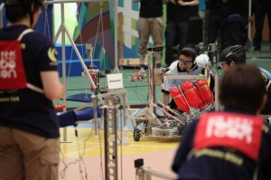
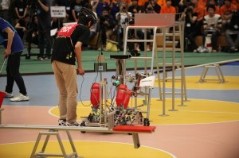

こんにちは、ぺったんです。 前回の記事([fortefibre.net/blog/?p=1679](http://www.fortefibre.net/blog/?p=1679))に引き続き、チーム・ピットメンバーしか知らない裏話の続きをお話したいと思います。

 

 

 

大会前日の夜、ロボットが課題を達成できない原因を予想し、翌日どのように動くかのシミュレーションをしてから会議はお開きになりました。 次の日の朝は、寝坊することなくちゃんとピットメンバー全員が起きることができました。 誰かが寝坊してしまうとその日の予定が狂ってしまうので、全員起きることができてよかったです。

 

その日の朝、食堂が開くのを待っている間に名古屋工業大学の先生とお話しをしました。 なんでも、昔に当大学と名古屋工業大学が合併する話が持ち上がっていたことがあったそうです。 もし合併していたら、今年は名古屋工業大学に加えて当プロジェクトも優勝していたのかもしれません。

 

その後、大会会場である体育館に入るとまずロボットのCADを確認しました。 CADを確認した結果、CADよりも子供ロボット（自動ロボット）のシーソー・ブランコ用のハンドが5mm長いことが判明しました。よって、ハンドが長いことでジャングルジムを達成できなかったのだと仮定しました。 前日のリーダー会議で、大会に出場する全チームがブランコの試し打ちを1回だけやらせてもらえることになっていたので、ブランコ用のハンドの片方を5mm切り落として試し打ちに備えました。 さらに、ジャングルジムを達成できない原因がわからなかったので、責任者の方にジャングルジムの寸法を測らせてくれるように交渉しました。許可は頂いたのですが、「そういうことは前日のリーダー会議の時に言ってくれ」とお叱りを受けてしまいました。

 

ブランコの試し打ちでは、ブランコ用のハンドが短くなってもブランコをつかことができるのかを検証しました。その結果、ハンドの奥までブランコが入れば自動ロボットが落ちないことがわかったので、もう片方のブランコ用のハンドも切り落とすことにしました。 しかし、このハンドを短くしたことが原因で、後々大きな障害になってしまいます。

 

 

今回はここまでです。次回は大会当日の試合の時の模様について書く予定です。お楽しみに！

 

次回の更新は8月4日(月)を予定しています。 では、失礼します。
