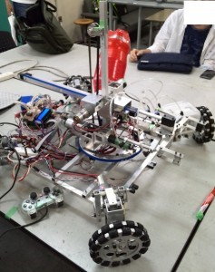

ふじきです。  
試験や課題で忙しくて中々予定通りの更新ができないことをお詫びします。 ようやく夏休みに入ったのでこれからは更新遅れが無くなると思います。  
本来なら月曜日に更新する予定でしたが、こちらの都合で木曜日に更新することになったので月曜日に更新するはずだった記事はひとまず置いておいて明日と明後日のオープンキャンパスの宣伝をしておこうと思います。  
今年のオープンキャンパスではこれまでの活動実績を加味してか去年よりも広い展示スペースをいただきました。 展示場所はセンターホールと呼ばれる当大学の西部構内にある建物の2階で8/8(金)、8/9(土)の10時から16時までの間で取り行います。  
展示内容は当プロジェクトの活動実績や今年のNHKロボコン2014に参加した手動ロボットと自動ロボットに加え、以前からブログの記事で紹介しているように来場してくれた方には広報用ロボットの操作体験をしてもらおうと思っています。  試験期間であるにも関わらず担当の2回生メンバーたちが腐心して制御と機体改良を行ってくれたので当日はその役割を全うする働きをしてくれると思います。  
当日来てくれた方にはメンバーが総出で対応するのでどうぞ気兼ねなく見学に来てください。  
次回の更新予定日は8月8日(金)です。 では失礼します。
