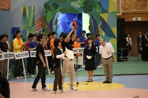

こんにちは、ぺったんです。 前回の記事([fortefibre.net/blog/?p=1707](http://www.fortefibre.net/blog/?p=1707))に引き続き、チーム・ピットメンバーしか知らない裏話の続きをお話したいと思います。

 

 

 

前日は、子供ロボット（自動ロボット）がポールウォークの最後の板をつかめないままテストランが終了しました。よって、ポールウォークが成功する確証がないままいよいよ本番を迎えてしまいました。

 

自動ロボットはテストランの挙動から課題を達成できるか怪しかったのですが、操縦者は至って冷静で、落ち着いてシーソー・ブランコの課題をクリアし、ついにポールウォークにたどり着きました。 操縦者がポールウォークに自動ロボットを設置すると、着実にポールを渡り歩き、ついにポールウォークを渡り切りました！ 自動ロボットの制御担当者は、「テストランではポールウォークが成功せず、ずっと不安だったので、成功してすごく嬉しかった」と言っていました。 残念ながら、ジャングルジムは自動ロボットを設置した時にタイムアップとなりできませんでしたが、初戦を勝利で終えることができました。 ピットに帰ってくると、安心感からか制御担当者が泣き崩れてしまい、前日での焦り方とも相まって、制御担当者が操縦者に「メンタル弱すぎ」と言われていました。

 

試合の合間はロボットの調整を終えると暇になるので、他校のピットにお邪魔してロボットについて色々質問したり、また質問されたりしていました。 質問したことには快く答えてくれるので、フィールド上では敵同士ですが、ピットではすごくアットホームな雰囲気で心地よかったです。

 

次の2戦目も勝利することができましたが、ここでいよいよジャングルジムが問題になってきました。 前日のテストランでは、自動ロボットはポールウォークにほとんどの時間を割いてしまっていたため、ジャングルジムの調整は全くと言っていいほど進んでいませんでした。 どうしようか悩んでいるときに、当プロジェクトのリーダーが東京農工大学の昨年度のリーダーの方と偶然お会いして、交渉したところ、なんと東京農工大学様が会場に持ってきてくださっていたジャングルジムを貸していただけることになりました。 このジャングルジムのおかげでジャングルジムの調整を行うことができ、本番では披露できませんでしたがジャングルジムも成功するようになりました。東京農工大学様、本当にありがとうございました！

 

決勝リーグでは、残念ながら準々決勝で敗退しました。その決勝リーグの終盤では、当プロジェクトのところに大学ロボコンのスタッフ様が来て、「大会終了後の技術交流会に京都工芸繊維大学もぜひ参加してほしいので、ロボットは片づけないでほしい」と言われました。 技術交流会は、本来優勝・準優勝のチームのみが他のチームに対して行うものであるのに、審査員の方に自動機のロバスト性（柔軟な対応力）が評価され、それを他チームに披露できることになりました。 技術交流会では、一番最初に本番で披露することができなかったジャングルジムを披露しました。 親ロボット（手動ロボット）が自動ロボットをジャングルジムに設置するところから見せて、1度で"SHABAASH"が成功しました！ ポールウォークの次に見せたかった動作であったので、披露することができてよかったです。

 

これが私たちのNHK大学ロボコン2014でした。 後輩たちにはピットで起こり得ることや注意点などを伝えていき、来年こそは優勝してほしいです。

 

これでチーム・ピットメンバーしか知らない裏話を終わります。 全4回にわたる記事を読んでくださりどうもありがとうございました！

 

今回はここまでです。では、失礼します。
