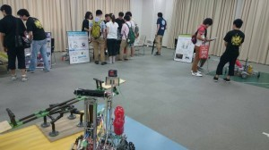

こんにちは。ふじきです。  
先週の金曜日、土曜日に当大学でオープンキャンパスがありました。   
例年通りNHKロボコン2014に出場した自動ロボット、手動ロボットの展示、今年は当大学で開催される予定のキャチロボバトルコンテストの紹介に加え、当プロジェクトによく用いられている機構や基板の紹介、広報用ロボットの操作体験など今年は去年よりも会場が広くなった分、より規模の大きい展示をすることができました。 土曜日は台風の影響で雨に見舞われましたが、それでも2日間で多くの人に足を運んでもらい当プロジェクトの活動をより広く知ってもらうことができました。  
本来なら広報用ロボット以外にもこのようなイベント向けに用意していた展示物が幾つかあったのですが、時間の都合で完成が間に合わなかったためお見せすることができませんでした。 いずれこのブログで取り上げる予定でいます。  
受験生の方々、まだそうでない人たちにとって今回のオープンキャンパスが当大学を受験しようとするきっかけの一つになってくれたならとても嬉しいです。 より多くの新入生が来年、当プロジェクトに入ってきてくれるように今年も頑張って活動していきます。  
それでは今日はこれで失礼します。
