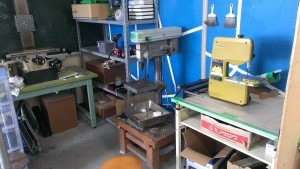

こんにちは、ぺったんです。

 

先週の水曜日、8月6日に部室の大掃除を行いました。

 

今回の大掃除では、部室内を掃き掃除したり溜まったゴミを捨てるのはもちろん、もう動かすことがないであろうロボットの分解や、部品の在庫の確認などをしました。 在庫を確認したあと、ハード班、ソフト班ともに基盤や構造材などの仕分けをしました。ソフト班がいらない基盤を次々と捨てているのが印象的でした。 また、コンターや旋盤などの工作機械を設置する場所を確保するために部室の配置換えをしたり、NHK大学ロボコンのロボット運搬用の木箱を棚に改造したりしました。

 

大掃除の結果、工作機械周辺はスッキリして、また部内で進行しているプロジェクトごとに部品やロボットが小分けされたので、とても作業がしやすい環境になりました。

 

 

 

それでは、今日はこれで失礼します。
