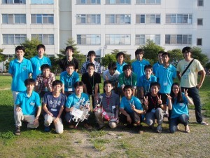

こんにちは。ふじきです。  
当プロジェクトは今週の月曜日に豊橋技術科学大学のロボコン同好会と交流会を行いました。  豊橋と言えばNHKロボコン強豪校の一つでもあり、今年のNHKロボコンでは観客の度肝を抜いたジャンプする自動ロボットで東大を降した試合がとても印象に残っています。  
去年、今年と連続でベスト8入りを果たしたとはいえ当大学と強豪校の間にはまだまだ高い壁が立ちはだかっています。 当プロジェクトとしては豊橋のような強豪校から少しでも技術やプロジェクトの運営方法を吸収して来年のNHKロボコンで優勝争いに食い込みたいところです。  
交流会では今年のNHKロボコンのロボットの機構やプロジェクトの体制、部室の紹介を主に行っていただきました。 気になっていた自動ロボットは実際に間近で見てみると思いのほか単純な構造をしており、むしろ手動ロボットのギミックの多さに驚きました。 更に驚かされたのは機体の各部に3Dプリンターで作られた樹脂製の部品が使用されていることです。 自分は大学の授業の一環で実際に卓上3Dプリンターを使ったことがありましたが、思い通りにいかずその扱いの難しさに辟易しましたが、ロボコン同好会は多くの試行錯誤を経てその使い方を熟知しており、平歯車までも自作していました。  
当プロジェクトでは部室内に置いてある工作機械が少ないためしばしば大学の工場で加工を行う必要がありますが、ロボコン同好会では3Dプリンターや部室に置いてある工作機械を利用し、なるべく工場での加工に依存しない設計を重視することで短期間で多くの試作機を作り、今年の自動ロボットを作り上げることに成功しました。 他にも学ぶべきことはたくさんありましたが、特に加工スケジュールが思い通りにいかないことが多い当プロジェクトにとってロボコン同好会のやり方はとても参考になったと思います。  
ロボコン同好会のみなさん、ありがとうございました。
