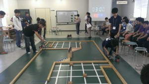

こんにちは、ぺったんです。

 

本日8月23日に当プロジェクトは金沢工業大学に行き、金沢工業大学・新潟大学の方々と交流会を行いました。

 

 

交流会は、まず「SRC」と呼ばれる新人大会を見学し、その後3大学間の交流を行うという形で進めていただきました。

 

「SRC」とは、金沢工業大学と新潟大学が参加されているロボコンで、1回生しか出場資格がなく、参加者の経験や技術を積むことを目的とした大会です。 当プロジェクトが不定期に開催している部内ロボコンとは違い、ルールがしっかり作りこまれていて、ハード班・ソフト班共ににまんべんなく技術を習得できるような内容でした。

 

大会中は、ロボットが課題を達成するたびに会場が沸いたり、両者とも最終課題をクリアすることができなくなるくらい接戦になったりして、とても見応えのある内容でした。 当プロジェクトは大会には参加せず見学のみでしたが、ロボットの動作を見るだけでもとても勉強になりましたし、また見学したことで交流会に参加したメンバーの士気が上がったように感じました。 来年は当プロジェクトも参加しないかというお誘いを頂いたので、機会があれば是非参加したいと思います。

 

交流会では、金沢工業大学様のNHK大学ロボコンに出場したロボットを間近に観察させて頂いたり、金沢工業大学・新潟大学の方々とお話をしたりしました。 金沢工業大学はABUロボコン2013の世界王者ですし、また新潟大学はNHK大学ロボコン2011でベスト4という成績を収めていらっしゃるので、ベスト8止まりである当プロジェクトにはない技術や運営のノウハウ等を持っていると思います。 ですので、今回の交流会を機に他大学様の様々な技術やノウハウを吸収し、これを今後に活かしていき、来年のNHK大学ロボコンではより良い成績を収められるよう頑張っていきたいところです。

 

金沢工業大学様のロボットを観察させて頂いたところ、既製部品の使い方やロボットの組み方、またリンク機構など、今後のロボットの設計に参考になる部分がたくさんありました。また、ベルトのテンションのかけ方などを、実際にロボットを見ながら解説をしてくださったのでとても勉強になりました。 新入生の教育の仕方やロボットの設計にかける時間などについても、たくさんのことについて金沢工業大学や新潟大学の方々からお話を頂くことができました。 当プロジェクトでは、今回の交流会に参加したメンバー全員が交流会で学んだことについてレポートを書くことになっているので、今回学んだことを残さずしっかりと後輩に伝えていきたいです。

 

金沢工業大学・新潟大学の皆さん、今日はありがとうございました。

 

それでは、今日はこれで失礼します。
