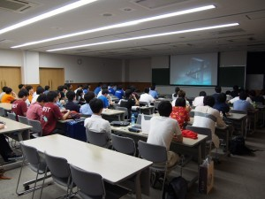
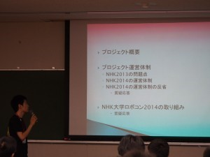

こんにちは、ぺったんです。

 

8月15日(金)に、当大学で9大学合同の技術交流会が開催されました。 その時の様子を広報担当の1人がまとめてくれましたので、今回はこれについて紹介したいと思います。

 

 

 

初めまして、2回生広報担当の牛木と申します。 先日８月１５日に、私たちの大学で開催された技術交流会について書きたいと思います。

 

参加大学は、大阪大学、大阪大学工業大学、立命館大学、横浜国立大学、工学院大学、ものつくり大学、東京工業大学、東京農工大学、と我々京都工芸繊維大学の計9校、総勢74名と、プロジェクトが始まって以来の大規模な交流会になりました。 今回の交流会では、各大学様にプレゼン形式で各々の団体の体制やNHK大学ロボコン2014の機体紹介などをしていただきました。 F3RCなどのNHK大学ロボコン以外の大会の情報や下回生の教育方法などの紹介もしていただいたので、とても参考になりました。

 

次に、部室紹介と今年のNHK大学ロボコンや広報用の機体を見てもらいました。 部室の状態や機体について他大学さんから意見をいただき、1時間では物足りないくらいでした。

 

そして、最後に立食形式のレセプションを行いました。 ここでは名刺交換などをして、より細かな情報の交換や大学間の交流を強めていただきました。 個人的には、レセプション終盤に挟んだロボコンクイズが予想に反して好評だったのが嬉しかったです。

 

最後に、今回の交流会は予定もカツカツで反省ばかりの運営でしたが、この交流会をきっかけに普段あまり交流のない大学同士の方々が知り合い、技術交流が進んでいき、ロボコン全体が盛り上がっていければ幸いだと思っております。 参加してくださった方、また協力してくださった方、本当にありがとうございました。 来年もまた技術交流ができる日を楽しみにしております。

 

それでは、今日はこれで失礼します。
