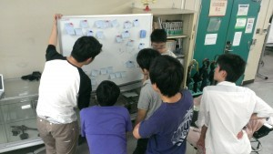
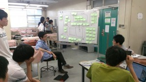

こんにちは、ぺったんです。

 

先日8月25日に、とうとうABUロボコン2015（NHK大学ロボコン2015）のルールが発表されました！ 今回のルールは、簡単に言うと「ロボット2台にバトミントンのダブルスの試合をさせる」というものです。 ロボット同士が直接対決するようになったり、無線操縦が解禁されたりと今までのルールの雰囲気とはガラッと変わっているので、今年は波瀾万丈な年になりそうです。

 

当プロジェクトでは、ルールが発表された翌日までにルールブックを翻訳して、各自アイデア出しを始めています。 このアイデア出しなのですが、今年は「ブレインストーミング」という手法を用いてアイデアを発表しています。

 

 

 

「ブレインストーミング」とは新たなアイデアを生み出す手法の1つで、ブレインストーミングにより得られたアイデアを整理することによって問題解決に結びつける方法です。 ブレインストーミングにも様々なやり方があるのですが、当プロジェクトでは次のようなルールに則って行っています。

 

・全員が順番に新規性のある発案をする。 ・「パス」や「前の人と同じ」は禁止。 ・どんな案にも否定はしない。 ・少人数の班に分かれてブレインストーミングを行う。

 

当プロジェクトでは、既に数回テーマを決めてブレインストーミングを行っています。 毎回各班から40～50個のアイデアが出ているので、これらをまとめたら優勝を狙えるようなすごいアイデアが生まれるかもしれません。 早めにアイデア出しを完結させて、試作機設計に取り掛かり動作確認をしたいところです。

 

それでは、今回はこれで失礼します。
