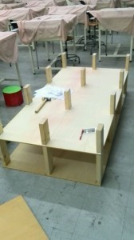

こんにちは。ふじきです。  
いよいよ第四回キャチロボバトルコンテストが今週土曜日に当大学で行われます。 今年も当プロジェクトもから2チームがエントリーしますが、本番に向けての最終調整で毎日忙しいです。 大掃除で綺麗にした部室も工具が散乱したり、材料が転がっていたりとやはりイベント事が事前に控えているとなかなか綺麗な状態を保つのが難しいです。  
そんな中あまり広いとは言えない当プロジェクトの活動スペースを少しでも有効利用するため棚を自作することにしました。  当プロジェクトの三回生が一人で作っている木製棚です。 完成すれば置き所に困っている部品や機材なども設置できるようになります。 今年は更に部室内にボール盤を一つ増やそうかという案もあり、そのためのスペースを確保しておかないといけないのでこれはとても助かります。  
キャチロボが終われば、すぐにNHKロボコンに向けて本格的に始動することになるのでまだ余裕のある今のうちに部室管理を行い、作業体制を整えておく必要があるでしょう。  
それでは今日はこれで失礼します。
