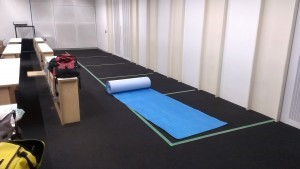
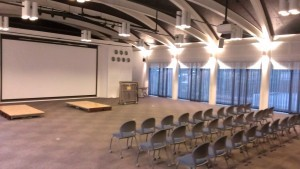

こんにちは、ぺったんです。

 

9月6日(土)に、当大学にて第4回キャチロボバトルコンテストが開催されます。 その会場の設営を、先日金曜日に行いました。

 

 

 

写真のように、試合会場に椅子やステージを整えたり、ピットやその周辺に養生シートを敷いたりしています。 当プロジェクトのメンバーだけでなく、立命館大学からお越しくださった方々も含め全員で会場設営を行いました。

 

今回のキャチロボバトルコンテストは、過去最大となる計11大学、18チームが参加する大規模な大会となっています。 当プロジェクトは昨年同様2チームが参加しますが、現在両チームとも大会当日に向けて最終調整に入っています。 昨年に引き続き今年も優勝できるよう精一杯頑張って行きたいと思います。どうぞ応援よろしくお願いします！

 

第4回キャチロボバトルコンテストが開催される場所は当大学の60周年記念館で、日時は9月6日(土)13:00～開会の予定です。 この大会は、一般の方でも事前エントリー不要で観戦していただけます。 昨年開催したキャチロボバトルコンテストと同様に、今年も白熱した試合が繰り広げられるかと思います。どうぞ気兼ねなくお越しください。

 

また、大会の模様はUSTREAMにて生中継される予定です。 詳しくはキャチロボバトルコンテスト公式ホームページを御覧ください。

 

会場アクセス [http://www.kit.ac.jp/01/01\_110000.html](http://www.kit.ac.jp/01/01_110000.html) キャンパスマップ [http://www.kit.ac.jp/01/gakunaimap/matugasaki.html](http://www.kit.ac.jp/01/gakunaimap/matugasaki.html)

 

公式ホームページ [http://catchrobo.net/index.html](http://catchrobo.net/index.html)

 

それでは、今回はこれで失礼します。
