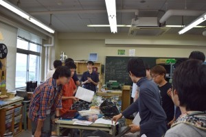

こんにちは、ぺったんです。

 

9月6日(土)に、第4回キャチロボバトルコンテストが開催されました。 その結果は、当プロジェクトは主催校であるにもかかわらず2回生チームは1回戦敗退、1回生チームは2回戦敗退という情けないものになってしまいました。 そこで、今回の敗退の原因を把握し、それを改善して次回に活かしていくために反省会を行いました。

 

 

反省は今回のキャチロボに関わった人すべてのメンバーに行ってもらいました。また、今回の反省は「レッスンズ・ラーンド」という手法を用い行いました。 「レッスンズ・ラーンド」とは、ある出来事について成功・失敗を振り返って整理し、これらを全体に共有する手法です。 具体的には、次の4点を各自具体的にまとめてきてもらい、メンバーが集まった時にこれらを共有するという形を取りました。

 

・上手くいったと思うこと ・失敗した・変えるべきだと思うこと ・反省すべきところの優先度 ・メンバー一人ひとりの最後の意見

 

メンバーが集まる前に全員が反省点をまとめてきてくれていたのですが、より深く反省するために反省会の後に各自に反省用のテンプレートを配りました。 これらの反省を活かし、来年開催されるキャチロボバトルコンテストには次こそ優勝したいところです。

 

またNHK大学ロボコンについては、既にアイデア選定が終了し試作機設計、フィールド製作が始まっています。 今年度のルールは練習量が勝敗を左右する重要な鍵になるであろうと予想できるので、1日でも早くロボットを完成させて操縦練習ができるようにしたいところです。

 

それでは、今回はこれで失礼します。
