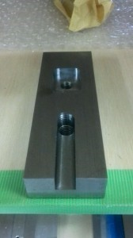

こんにちは。ふじきです。  
当プロジェクトのハード班のメンバーが工場の技官さんから本格的なフライス加工の講習を受けました。   
勿論、それ以前にも先輩たちからフライス加工についての講習を受けたり、講義でもフライス実習があるので使い方は知っているのですが、実際にロボコンで恒常的にフライスを使っているメンバーが少なく、個々人の持つ知識や技量にも差があったりでなるべくフライスを使った難しい加工を避けてきた場面もありました。  
今回の講習ではフライスによるワークの6面出しの正しいやり方やエンドミルで金属を削るときの細かい注意点など技官さんが現場の経験で手に入れた知識の多くを教えてもらいました。 これは今年だけの特別な講習会でここで教えてもらったことを後輩たちにきちんと継承していく必要があります。 そこで講習を受けた3回生の先輩に未来の後輩たちのためにテキストを作成してもらうことになりました。  
今年は部室のフライスも使っていく予定なので、今までフライスをあまり使ってこなかったハード班のメンバーも講習で得た知識を活かして気軽に加工できるようになるでしょう。 これまでは加工に時間がかかったり、加工できる人がいないという理由で諦めた部品などもつくれるようになるため設計の自由度が上がると思います。 来年のNHKだけでなく今後のプロジェクトの活動に大いに役立つ講習会でした。
