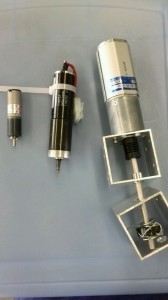

こんにちは。ふじきです。  
NHKのルール発表前から進められてきた技術開発の一つとして新しいモーターを導入するというものがありました。 その結果としてこちらが今回購入した新しいモーターです。  真ん中がマクソンモーター、両側のモーターが新しいモーターです。 左の小型モーターは小さいですが減速比が高く、見た目に反してかなりの高トルクをだせます。 右の大型モーターの方も見た目どおりの高トルクを出力できるのでラケットのスイング機構などの大きいトルクが必要な部分に使えそうです。  
当プロジェクトはこれまでマクソンモーターを好んで使っていました。 理由としてはモーターの詳細なデータシートが簡単に手に入るため設計の際に計算が楽なこと、起動トルクが高く反応が早いため高速化しやすい、制御性がよい、など様々な利点があるためNHKやキャチロボ等の大会用ロボットに使うモーターはほぼマクソンモーターのみで設計されています。  
とはいえマクソンモーターは比較的コストが高く、昔購入したものを代々流用して使っていますが徐々に経年劣化やトラブルなどにより壊れてしまったモーターが増えてきました。 他にもNHKやキャチロボだけでなく広報用のロボットなど多くのロボットを同時に作る機会が増えたためモーターの数が不足するという事態も表面化してきました。 新しいマクソンモーターを買い足すという案もありますが、これを機に新しく安いモーターを導入して以前までのマクソンの便利さに頼った設計を見直そうという方針になりました。  
今はまだ上の二つだけですが、今後は試作機構などに積極的に利用することで性能を評価し今年のNHKロボコンでの本番機でも利用したいと思います。

それでは今日はこれで失礼します。
