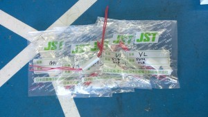

こんにちは、ぺったんです。

 

先日、日圧総業株式会社(JST)の担当者様からロボットに使用しているコネクタのサンプルをいただきました。 今日はこのことについてご紹介します。

 

 

当プロジェクトでは、コネクタは数年に渡り部室にある同じものを使用しています。 しかし、これらのコネクタは昔から代々使用しているもので設計が古く、抜き差しが硬くてなかなか外れなかったり、また無理に抜こうとして導線がちぎれてしまったりしていました。 よって、コネクタが原因で余計な作業が増えたり、ストレスが溜まる一因になっていたりしていました。

 

そんな中、先日JSTの担当者様からメールをいただき、当プロジェクトの部室にお越しになりました。 JSTの担当者様からは、JST様の最新のコネクタを紹介してくださったり、担当者様からコネクタについての知識を色々と教えていただいたりしていただきました。 また、その時に当プロジェクトの部室にお持ちくださっていたコネクタのサンプルを数点いただきました。

 

上の写真が、今回提供していただいたコネクタのサンプルです。 このコネクタは色々と工夫がなされていて、あまり力を加えなくても簡単に抜き差しができるようになっていました。 当プロジェクトのメンバーらがこのコネクタのサンプルを触ったところ、ほとんどのメンバーが最初に「抜き差ししやすい」と答えていました。 また、簡単に抜き差しができるのにも関わらず、従来のコネクタと比較しても流せる電流量は同じだということです。 よって、これらのコネクタを使用すれば、これらの問題を解決することができそうです。

 

JST様がお越しいただいたおかげで、当プロジェクトではコネクタを一新しようという話が出ています。 当プロジェクトでは、今まではもっと良い性能のコネクタがないか探したりしたことがなかったので、今回はコネクタについて考えるいい機会になりました。 また、今回提供していただいたもの以外にも提供してほしいものがあれば、サンプルを郵送していただけるということです。 JST様、どうもありがとうございました。

 

それでは、今回はこれで失礼します。
