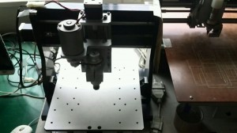

こんにちは。ふじきです。  
当プロジェクトは今年度から卓上旋盤や卓上フライス(工具が足りないためまだ使用できません)を導入し始め部室内にも工作機械が増えてきました。 このまま工作機械が充実していけば工場に行けない土日でも加工ができるようになるので製作期間が短くなり次々とロボットが作れるようになることでしょう。 という訳で当プロジェクトはこの流れに乗り更なる加工環境の拡充のため卓上CNCフライスを導入しました。  
  
上の写真がその現物です。基盤加工機と仲良く並んでいます。 現状ではPCの買い替えに伴い、CNC機械を扱う環境が整っていないため使用できませんが使えるようになれば難しい部品などもプログラムを入力すれば自動で加工してくれるので非常に助かります。  
夏季休暇も終わり講義と課題に追われながらになりますが、来年のNHKロボコン優勝に向けて頑張っていきます。
