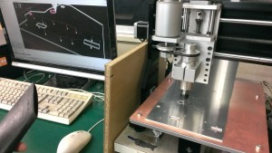
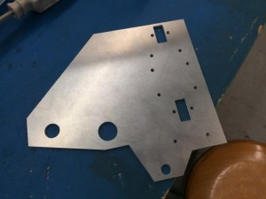
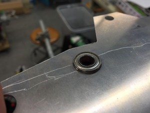

こんにちは、ぺったんです。

 

先日当プロジェクトに卓上CNCフライスを導入したことをお伝えしましたが、ソフト班のメンバーがPCの環境を整えてくれたので動作するようになりました。

 

 

上の写真がCNCフライスを動作させている様子です。試しに手作業で加工をするのが面倒なパーツを加工しています。 PC上の画面の針の動きに合わせて機械が動いている様子がとても興味深いです。 そして完成したパーツがこちらです。

 

 

 

外形・穴・肉抜き共に精度よく加工出来ています。ベアリングもぴったりはまります。 どうしてもバリ取りといった工程が必要になるのでCNCフライスのみで加工を完結させることはできませんが、これで加工時間の短縮、また加工者の負担の軽減が期待できそうです。

 

まだ手で数えられるくらいのパーツしか加工していないため今後正常に動作するかどうかが分からないので、これから部品加工と兼ねて動作確認をしていきます。 またエンドミルの劣化が激しく1本につき数パーツしか加工できないので、手作業だと非常に時間がかかるものや重要なパーツにCNCフライスを使用する予定です。 CNCフライスのおかげで複雑なパーツを加工するのが容易になったので、これからは今まで以上に設計の幅が広がりそうです。

 

それでは、今回はこれで失礼します。
