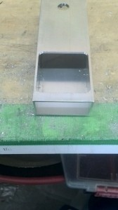

こんにちは。ふじきです。  
以前工場の技官さんに開いてもらったフライス講習を受けた当プロジェクトのメンバーが早速講習の成果を見せ始めました。  上の画像は角パイプの真ん中にポケットと呼ばれる四角い穴をフライスで加工して開けた部品です。  
設計をしていると時として角パイプに丸い穴だけでなく四角い穴を開ける必要が出てくるのですが、もちろんこのような穴を一発で開けられるドリルはありません。 これまでこのようなポケットのある部品を加工するときはまずけがき線を引いて小さい径のドリルでその線に沿って穴を開けて形抜きのようにして作っていましたが、寸法どおりのきれいな穴を開けられないことに加えてバリが大量に出るためポケットの周りを丁寧にヤスリで削る必要がありました。  
しかしフライス講習で正しい加工法を習得したことでこれまで難しかったポケットの加工がフライスできるようになりました。 ポケットの外形もボール盤で開けたときに比べるととてもきれいで、パイプのふちにぎりぎりまで寄せた穴ができています。  
今年度に入って工作機械が充実してきただけでなくメンバー全体の加工技術も上がりつつあるので、来年のNHKロボットは今までより一層高性能なロボットになることが期待できます。
