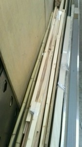

こんにちは。ふじきです。  
 来年のNHK2015の練習用フィールドに使う材料が届きました。 フィールドと言ってもルールに記載されているバドミントンのコートを覆うための柵を作るだけの話なのですが、可能な限り本番と同じ状態で練習したほうがいいのはこれまでの経験からも明らかです。  
今年は競技の性質上、室内で練習するのが難しいため体育館を借りてロボットの操縦練習する必要があります。 とはいえ体育館は運動部も使うためこれまでのようにどこかの部屋を長期間借りて練習するというようなことができないため練習する時間は限られてきます。 明日、体育館でロボットの動作試験を行いますが時間が限られているためできるだけ効率よくフィールドの設営、撤収を行う必要があるでしょう。  
良いロボットを作ることも勿論重要ですが、練習時間をどうやって少しでも長く確保するかが来年のNHKのキモになりそうです。
