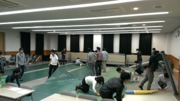

こんにちは、ぺったんです。

 

先週金曜日、9月17日に多目的室という部屋をお借りすることができたので、NHK大学ロボコン2015のフィールド設営を行いました。

 

 

今回の設営では、次回以降の設営の時にスムーズに作業が行えるようにロンリウムに番号を振ったり、ロンリウムの繋ぎ目にマーカーを打ったりしました。 今年はあらかじめCADでロンリウムの配置を決めていたので、スムーズに設営を行うことが出来ました。

 

今年からは、2014年のNHK大学ロボコンの失敗を活かしてフィールドは正確に、本番の状態に可能な限り近づけて練習をしようということになりました。 そのため、今年は今まで以上にロンリウムの配置に気を配ったり、フェンスには設営毎に位置がずれないように工夫したりしています。

 

今回お借りした多目的室は天井が低かったり、部屋の大きさからフィールドは全面ではなく片面しか敷けなかったりして操縦練習をするのには不向きであるため、この部屋はロボットの動作試験等に使用する予定です。 まだ先日届いたフェンスとして使用する木材の加工が終わっていなく、また体育館もお借りすることができていないので、早く操縦練習ができるように準備を進めていきたいところです。

 

それでは、今回はこれで失礼します。
