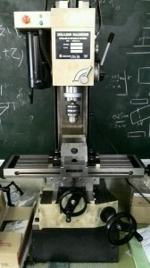
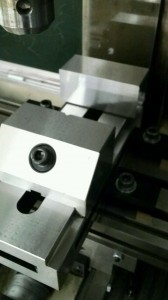

こんにちは。ふじきです。  
夏休みごろに当プロジェクトの部室に導入された卓上の三軸直交フライスですが、軸の調整や工具の手配などに時間がかかり残念ながら夏休み中には使用できる段階までには至っていませんでした。  
それでも工場の技官さんに各軸の調整をしてもらいつつ技官さんのアドバイスを受けながら地道に加工に必要な刃物やバイスを揃えていった結果、最近になっていよいよ実際に使用できる状態までもってくることができました。   
卓上なので大きい部品の加工はできませんが、小さい部品であればフライスで精度の高い加工がいつでもできるようになるのでロボットの試作機構なども高性能でかつ短い製作期間で作れるようになると思います。  
フライス講習で得た知識も部内で共有できるようにしてあるので今年からメンバー全員がフライス加工の技術を身に着けることができるようになります。 自分は主に旋盤部品をメインに加工していますが、これを機にフライスの加工にも取り組んでいきたいです。
