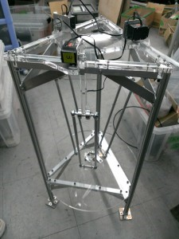
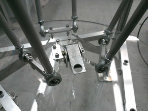
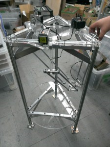

こんにちは、ぺったんです。

 

当プロジェクトでは、現在広報用ロボットの1つとしてパラレルリンクロボットを製作しています。 このロボットがかなり形になってきましたので、今回はこのことについてご紹介します。

 

　

 

パラレルリンクロボットとは、写真のように上部に取り付けられたモータのみでハンド部分を自在に動かすことができるロボットです。 ハンド部分を地面に対して水平を保ちつつ、上下左右前後に柔軟に移動させることができます。 例えば、右奥のモータを動かせば、ハンド部分が右奥へと水平を保ちながら移動します。

 

 

このパラレルリンクロボットは機構の関係上制御が非常に難しく、残念ながらまだ自動でハンドを動かすことはできていません。 制御ができるようになれば、テープル上に設置したお菓子を自在に運び、他の場所に置くという動作をさせる予定です。

 

また当プロジェクトは、11月8日(土)、9日(日)に開催される「青少年のための科学の祭典 京都大会」に参加します。 当プロジェクトのブースでは、どうやってロボットが動いているのかということを説明する予定です。 この際に、写真でお見せしたパラレルリンクロボットを展示する予定です。 科学の祭典当日では、ロボットが華麗に動作しているのを披露できるかと思います。

 

開催される場所は京都市青少年科学センター、京エコロジーセンターです。詳しくはホームページを御覧ください。 たくさんのご来場をお待ちしています。

 

それでは、今回はこれで失礼します。
